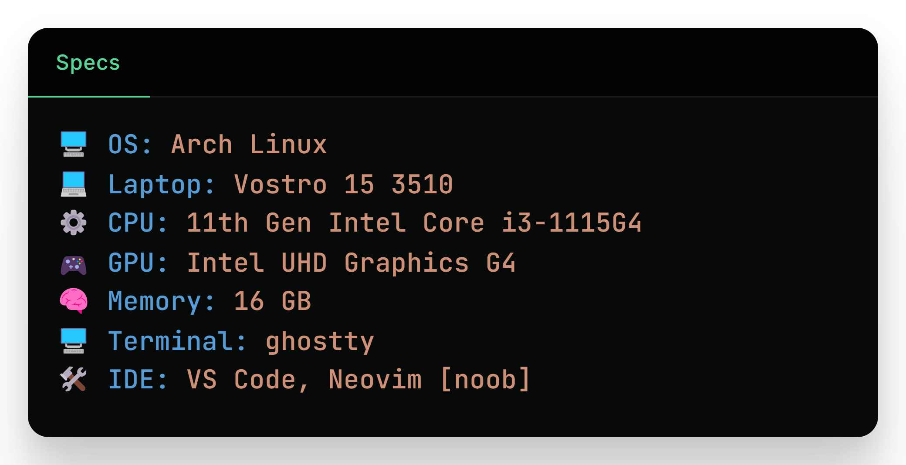

<!-- Header -->
<h1 align="center">👋 Hey there, I'm Abhiman</h1>

Python Developer • Notion Creator • Linux User

<!-- Skills / Tools -->

<!-- Projects -->
### 🧰 Featured Projects
- 🎨 [**Vortex**](https://github.com/abhimangs/obsidian-vortex) – A beautifully animated and highly customized theme for Obsidian with **2300+ active users**.
- 🛠️ [**dotfiles**](https://github.com/abhimangs/dotfiles) – My personal Linux dotfiles bundled with CLI tools and install scripts to set up my entire system in one go.

<!-- About Section -->
### 🧠 About Me
- 🎓 I'm a high school graduate currently exploring the world of Linux and open source.
- 🚀 I love building projects that interest me and help others along the way.
- 🎓 I completed [Harvard's CS50 Introduction to Computer Science](https://certificates.cs50.io/baa4fbfe-b4ab-4938-8eb7-40b9a88017f7.pdf?size=letter) in May 2024.

<!-- GitHub Stats -->
### 🍁 GitHub Stats

  
  

  

<!-- GitHub Stats -->
### 🎯 My Current Goals

- 🔧 Working on completing my **[Arch Linux dotfiles](https://github.com/abhimangs/dotfiles)** setup so I can bootstrap my system in one go  
- 🌟 Aiming to get **100 stars** on my **[Vortex](https://github.com/abhimangs/obsidian-vortex)** Obsidian theme, would mean a lot!  
- 🐍 Grinding Python daily to reach that **advanced** level and build cooler stuff

### ⚙️ PC Specifications

  

<!-- ⚙️ Skills & Tools -->
### ⚙️ Skills & Tools

<!-- Contact -->
### 🌐 Connect with Me
**Get in Touch:** Drop me a line at **[theabhimangs@gmail.com](mailto:theabhimangs@gmail.com)** for collabs, queries, or a quick hello!

